<a name="readme-top"></a>


# CVs-repository</br>&nbsp;&nbsp;&nbsp;

> Welcome aboard fellow developer, this is where you will find projects which you are free to contribute to. You can contribute by submitting your own scripts, which you think would be amazing for other people to see.

## Description

Web application built with ***ASP.NET 5***, used to store the resumes it receives. User can submit a CV when he fills in all the required fields on the form. User can search, view, edit, delete any CV he chooses. Web application validates user input on both the client and server side.

## Installation

Download the project from github to your desktop:

  - **With Git** :
      If you’re familiar with git and have it installed on your computer, you can clone the repository to download the files.
      
      **1.** Click the green button labeled &nbsp;`Code`</br>
      
      &nbsp;&nbsp;&nbsp;&nbsp;&nbsp;&nbsp;&nbsp;&nbsp;&nbsp;&nbsp;&nbsp;&nbsp;&nbsp;&nbsp;&nbsp;&nbsp;</br>
      
      **2.** Copy the URL of the repository</br>
      
      **3.** Next, on your local machine, open your bash shell and change your current working directory to the location where you would like to clone your repository
      ```shell
      cd "path-to-your-folder"
      ```
      
      **4.** Once you have navigated to the directory where you want to put your repository, you can use
      ```shell
      git clone https://github.com/MouhammadAyoub/CVs-repository.git
      ```
      
      **5.** When you run `git clone https://github.com/MouhammadAyoub/CVs-repository.git`, You should see output like
      ```shell
      Cloning into 'test-repo'...
      remote: Counting objects: 5, done.
      remote: Compressing objects: 100% (4/4), done.
      remote: Total 5 (delta 0), reused 0 (delta 0), pack-reused 0
      Unpacking objects: 100% (5/5), done.
      Checking connectivity... done.
      ```
      </br>
      
  - **Without Git** :
      When downloading materials to your laptop, it is easiest to download the entire repository.
      
      **1.** Click on the green `Code` button, then download the repository as a ZIP file</br>
      
      &nbsp;&nbsp;&nbsp;&nbsp;&nbsp;&nbsp;&nbsp;&nbsp;&nbsp;&nbsp;&nbsp;&nbsp;&nbsp;&nbsp;&nbsp;&nbsp;</br>
      
      **2.** Find the downloaded .zip file on your computer, likely in your Downloads folder</br>
      
      **3.** Unzip it, this will create a folder named after the GitHub repository</br></br>

  - **Steps you must do to make the app work properly** :
      
      **1.** Change the server name of the `ConnectionStrings` attribute in the `appsetting.json` file</br>
      
      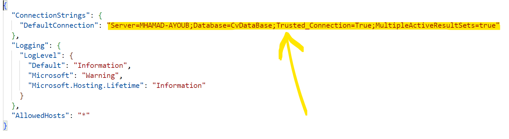</br>
      
      **2.** Open the `package manager console`</br>
      
      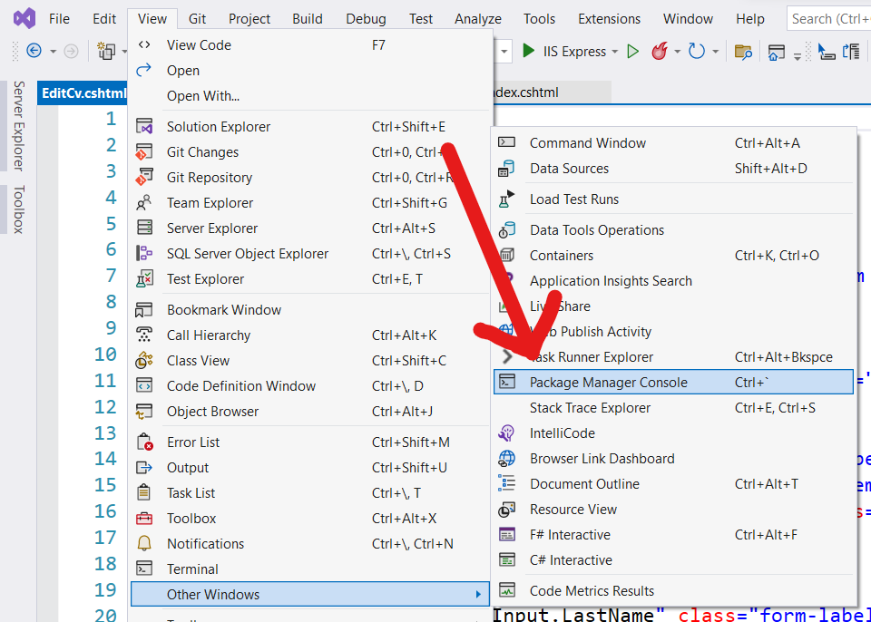</br>
      
      **3.** Run the `update-database` command
      ```console
      PM> update-database
      ```
      
<p align="right">(<a href="#readme-top">back to top</a>)</p>

## Usage</br>

- ***Welcome Page :*** &nbsp;This is the `First Page` that appears when you enter the website 👇

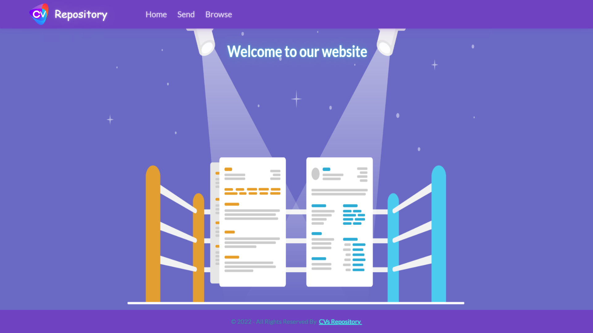</br>

- ***Send Page :*** &nbsp;This is the page where you `Have To` fill in all the fields in order to save your CV

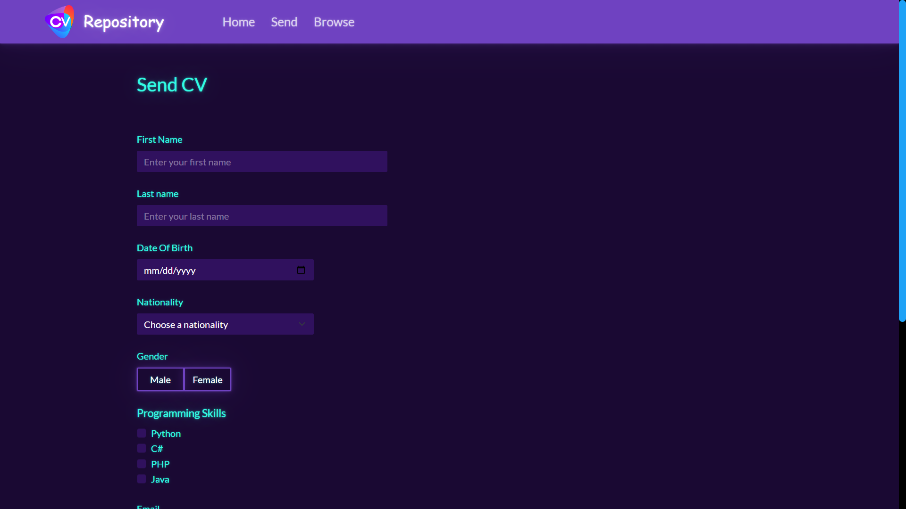</br>

***Note :*** &nbsp;If you forget to fill in any field and click the Submit button, a `Validation Message` will appear below it

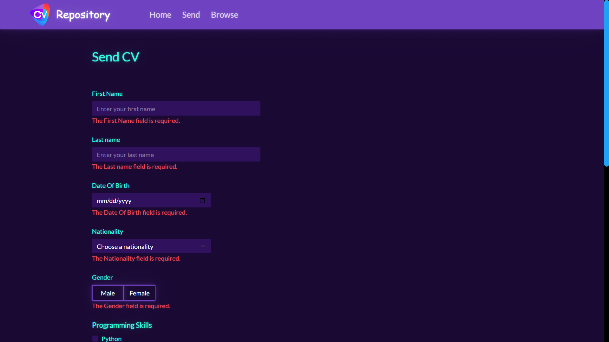</br>

***Note :*** &nbsp;When you click the Submit button, a `Verification Module` will appear and ask you to enter the sum of two random numbers (The issue of checking whether you are a robot or not has nothing to do with this)

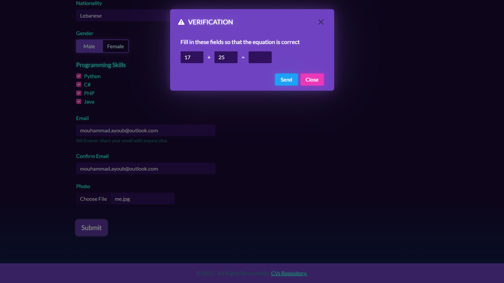</br>

- ***Summary Page :*** &nbsp;If you pass the step of sending your CV, you are redirected to the summary page which contains the `Information You Submitted` with the option to generate it as a pdf file

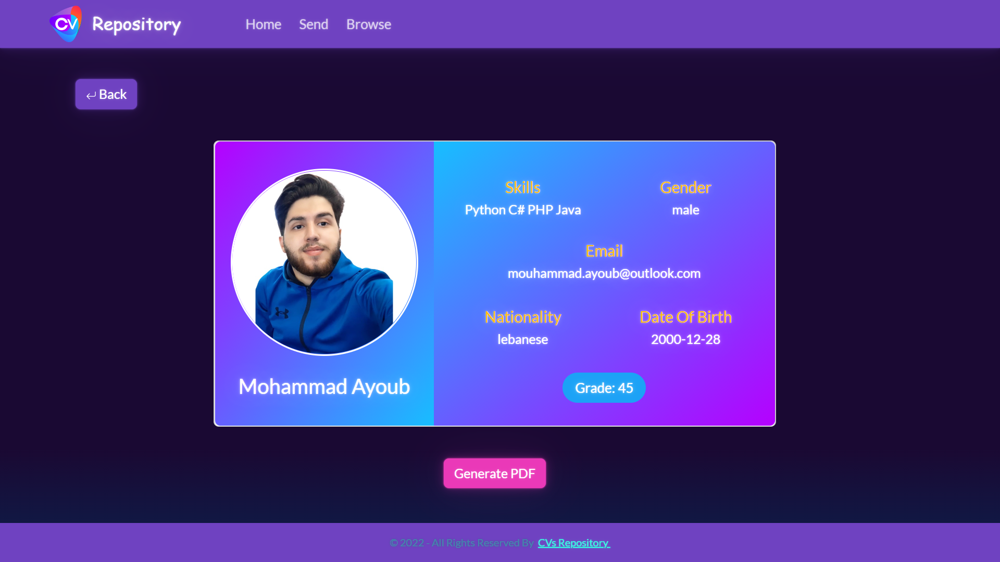</br>

- ***Browse Page :*** &nbsp;The browsing page is the page that contains `All The Resumes Stored` in your web application

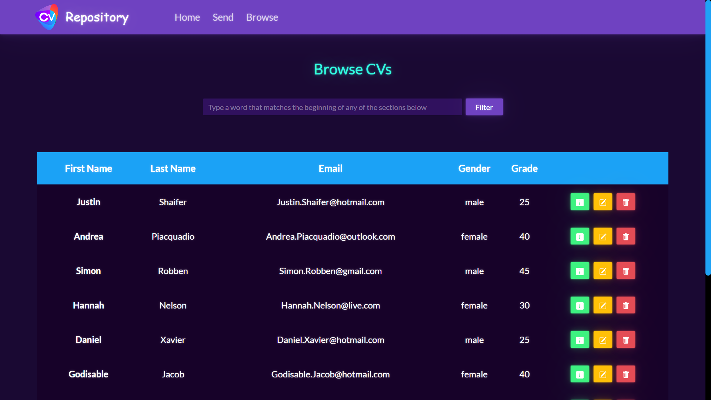</br>

***Note :*** &nbsp;If you click on the green button, you will be redirected to the `Summary Page` containing the corresponding record information

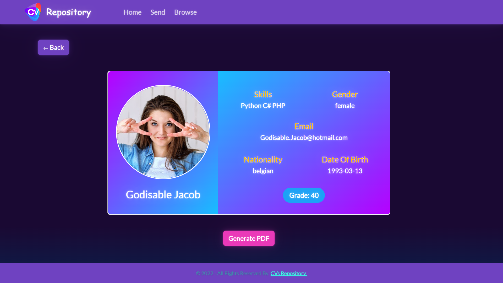</br>

***Note :*** &nbsp;If you click on the orange button, you will be redirected to the `Edit Page` containing the corresponding record information with the ability to change it.

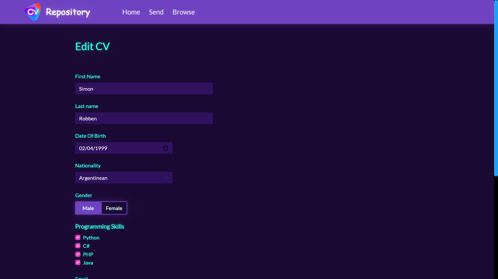</br>

***Note :*** &nbsp;If you click on the red button, a `Confirmation Module` will appear asking you to confirm your request to delete this record

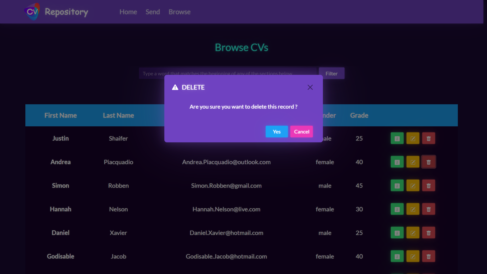</br>

***Note :*** &nbsp;You can use the filter option with `Any String That Matches` any word from the table attributes (such as using the word female for example as shown in the image below)

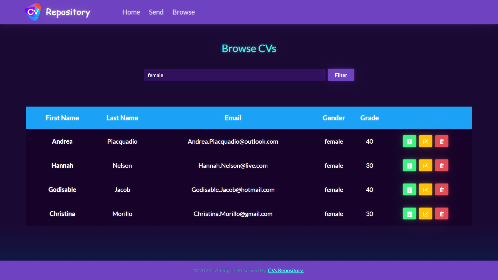</br>

<p align="right">(<a href="#readme-top">back to top</a>)</p>

## Contribution Guidelines

The contribution guidelines are as per the guide [HERE](https://github.com/MouhammadAyoub/CVs-repository/blob/main/CONTRIBUTING.md).

<p align="right">(<a href="#readme-top">back to top</a>)</p>

## Instructions

- Fork this repository
- Clone your forked repository
- Add your scripts
- Commit and push
- Create a pull request
- Star this repository
- Wait for pull request to merge
- Celebrate your first step into the open source world and contribute more

<p align="right">(<a href="#readme-top">back to top</a>)</p>

## License

Distributed under the MIT License. See [`LICENSE`](https://github.com/MouhammadAyoub/CVs-repository/blob/main/LICENSE) for more information.  
Copyright © 2022, Mohammad Ayoub

<p align="right">(<a href="#readme-top">back to top</a>)</p>

## Contact

- Email&nbsp;&nbsp;&nbsp;&nbsp;&nbsp;&nbsp;&nbsp;&nbsp;&nbsp;&nbsp;&nbsp;:&nbsp;&nbsp;[mouhammad.ayoub@outlook.com](mailto:mouhammad.ayoub@outlook.com)

- Project Link : &nbsp;[https://github.com/MouhammadAyoub/CVs-repository](https://github.com/MouhammadAyoub/CVs-repository)

<p align="right">(<a href="#readme-top">back to top</a>)</p>

## Additional tools to help you get Started with Open-Source Contribution

* [How to Contribute to Open Source Projects – A Beginner's Guide](https://www.freecodecamp.org/news/how-to-contribute-to-open-source-projects-beginners-guide/)
* [How to Write a Good README File for Your GitHub Project](https://www.freecodecamp.org/news/how-to-write-a-good-readme-file/)

#### Note: When you add a project, add it to the README for ease of finding it.
#### Note: Please do not have the project link reference your local forked repository. Always link it to this repository after it has been merged with main.

<p align="right">(<a href="#readme-top">back to top</a>)</p>

-----------
